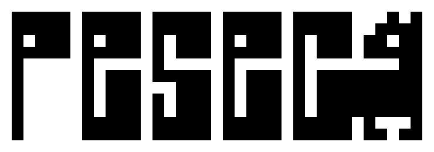

# PESEC - simple interpreted programming language

everything in pesec is **assignable**:
- numbers, strings and other
```pesec
mutab a = 12; # mutable variable #
const b = "Hello, World!"; # constant #
const c = [1, true, "hi"];
```
- functions
```pesec
const f = fn () {
    "Hey!";
}; 
f(); # returns string value after call  #
```
- structures
```pesec
const point = struct {
    x = 0,
    y = 0,
    move = fn(dx, dy) {
        # "this" is a struct object #
        this.x = this.x + dx;
        this.y = this.y + dy;
    }
}; 

point.f(42, 69); # fields inside succesfully changes #
```
- modules
```pesec
const math = import "math.pesec"; # for example #

math.PI;
math.pow(2);
```
- if/else conditions and loops also return value after execution
```pesec
const if_else_result = if (5 > 2) "Abc" else "Def";
```
```pesec
mutab i = 0;
const while_result = while (i < 5) {
    i = i + 1;
    break i; # returns value from loop #
}
else 420; # if loop not stoped by break statement #
```